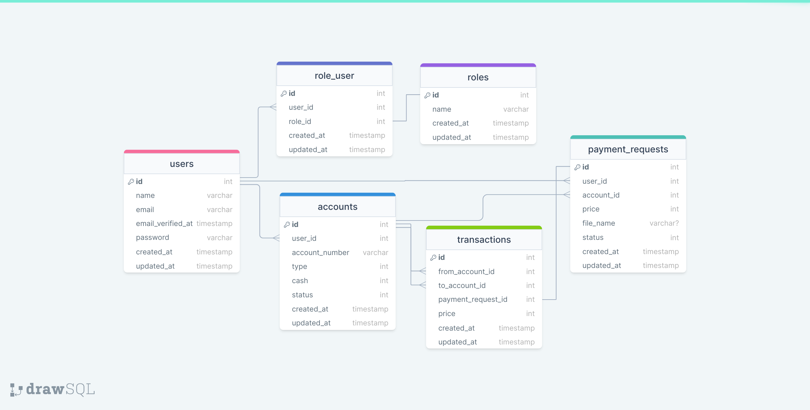

## about

Technologies used in this project
1. PHP 8.1
2. Laravel 9
3. Docker -> php + composer + nginx + mysql
4. bootstrap 

- use database transaction in `App\Http\Controllers\Admin\Payment\PayController`
- add `IsAdmin` Middleware for admin permission
## Database Design


## Project View
Some picture of the view of the project
***


## Route list
```
GET|HEAD / ...........................................................................................

GET|HEAD account/create/{user} ............... account.create › Admin\Account\AccountController@create

POST account/store ......................... account.store › Admin\Account\AccountController@store

GET|HEAD api/user ....................................................................................

GET|HEAD home ............................................................ home › HomeController@index

GET|HEAD login ............................................ login › Auth\LoginController@showLoginForm

POST login ............................................................ Auth\LoginController@login

POST logout ................................................. logout › Auth\LoginController@logout

GET|HEAD password/confirm .......... password.confirm › Auth\ConfirmPasswordController@showConfirmForm

POST password/confirm ..................................... Auth\ConfirmPasswordController@confirm

POST password/email ............ password.email › Auth\ForgotPasswordController@sendResetLinkEmail

GET|HEAD password/reset ......... password.request › Auth\ForgotPasswordController@showLinkRequestForm

POST password/reset ......................... password.update › Auth\ResetPasswordController@reset

GET|HEAD password/reset/{token} .......... password.reset › Auth\ResetPasswordController@showResetForm

GET|HEAD pay/{request_id} .............................. payment.pay › Admin\Payment\PayController@pay

GET|HEAD register ............................ register › Auth\RegisterController@showRegistrationForm

POST register ................................................... Auth\RegisterController@register

GET|HEAD request_payment/index .......... request.index › Admin\Payment\PaymentRequestController@index

POST request_payment/store .......... request.store › Admin\Payment\PaymentRequestController@store

GET|HEAD sanctum/csrf-cookie ....... sanctum.csrf-cookie › Laravel\Sanctum › CsrfCookieController@show

GET|HEAD users .............................................. users.index › Admin\UserController@index

POST users .............................................. users.store › Admin\UserController@store

PUT|PATCH users/{user} ..................................... users.update › Admin\UserController@update

DELETE users/{user} ................................... users.destroy › Admin\UserController@destroy

GET|HEAD users/{user}/edit .................................... users.edit › Admin\UserController@edit
```
